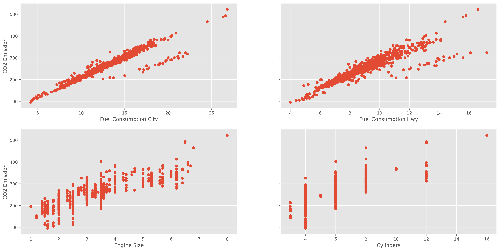
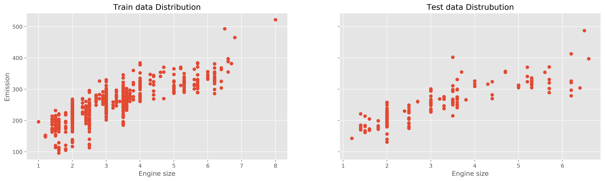
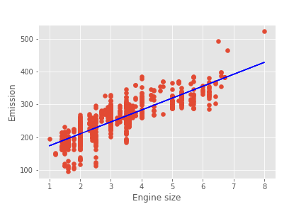

# Creating a Model for predicting the CO2 Emissions of the given characteristics of a car.

This program consists in creating a model using linear regression to determine the possible CO2 emission of a car given the engine size, numbers of cylinders and fuel consumption. he programming language used is Python and the libraries used are Pandas, Numpy, Matplotlib and Scikit-learn.

### The Dataset

The dataset used in this project is from the  [Fuel consumption ratings](https://open.canada.ca/data/en/dataset/98f1a129-f628-4ce4-b24d-6f16bf24dd64) published by the [Natural Resources Canada](https://www.nrcan.gc.ca/home). The dataset is from the year 2019.

### Visualizing the data

To understand better the data, it is important to visualizing it first. During the process, the data set was modified because of the format, and only the important components of the data set were extracted, like fuel consumption in the city and highway, the engine size and the number of cylinders.



The data shows a lineal tendency, so we can assume that a linear regression model will fit the data.

### Creating the model

For the model it was choose for training 80% of the data and 20% for testing. The following line of code creates a mask using rand from Numpy, it takes the size of the data frame and create random numbers from a **uniform distribution** over [0,1) and with then condition <0.8 it creates a array of booleans when the values are lower than 0.8. 

```python
import numpy as np
mask = np.random.rand(len(df)) < 0.8
```

The following line of code divide the data frame in two pieces. One corresponding the 80% for training and the other 20% for test. The symbol **~** is the negation.

```python
train = df[mask]
test = df[~mask]
```

We plot the training and test data.



A linear regression is just the equation of the line <a href="https://www.codecogs.com/eqnedit.php?latex=\hat{y}&space;=&space;\theta_0&plus;\theta_1x" target="_blank"></a>.

<a href="https://www.codecogs.com/eqnedit.php?latex=\theta_0" target="_blank"></a>: is the dependent variable, what the model will predict, in this case the CO2 Emissions.

<a href="https://www.codecogs.com/eqnedit.php?latex=\theta_0" target="_blank"></a>: is the independent variable, what the model will use to predict <a href="https://www.codecogs.com/eqnedit.php?latex=\theta_0" target="_blank"></a>, in this case the Engine Size.

<a href="https://www.codecogs.com/eqnedit.php?latex=\theta_0" target="_blank"></a>: is the intersection with the axis of Emissions.

 <a href="https://www.codecogs.com/eqnedit.php?latex=\theta_0" target="_blank"></a> : is the slope of the model.

The library Scikit-learn provides a linear model which calculates the values of   <a href="https://www.codecogs.com/eqnedit.php?latex=\theta_0" target="_blank"></a> and  <a href="https://www.codecogs.com/eqnedit.php?latex=\theta_0" target="_blank"></a> .

```python
from sklearn import linear_model
regr = linear_model.LinearRegression()
train_x = np.asanyarray(train[['Engine Size']])
train_y = np.asanyarray(train[['CO2 Emissions']])
regr.fit(train_x, train_y)
```

After training the model, the values are:

<a href="https://www.codecogs.com/eqnedit.php?latex=\theta_0&space;&=&space;137.94132173" target="_blank"></a>

<a href="https://www.codecogs.com/eqnedit.php?latex=\theta_1&space;&=&space;36.27157023" target="_blank"></a>

Now we plot the line with the training data to see how well it fits.



### Predicting

Now we need check if the model predicted the values of emissions right or not. For that we are going to use the test data to calculate the **(M)ean (A)bsolute (E)rror**, the **(R)esidual (S)um of (S)quares** and the **Coefficient of Determination** <a href="https://www.codecogs.com/eqnedit.php?latex=\theta_1&space;&=&space;36.27157023" target="_blank"></a>. This values shows if there is any discrepancies with the test data and what was predicted. The lower the values of MAE and RSS the better. And if  is closer to 1, it means it the model fits the data perfect. Using the Library Scikit-learn and Numpy we can calculate this three values.

```python
from sklearn.metrics import r2_score

test_x = np.asanyarray(test[['Engine Size']])
test_y = np.asanyarray(test[['CO2 Emissions']])
y_predict = regr.predict(test_x)

MAE = np.mean(np.absolute(y_predict - test_y))
RSS = np.mean((y_predict - test_y) ** 2)
R2 = r2_score(y_predict , test_y) 
```

The values are:

<a href="https://www.codecogs.com/eqnedit.php?latex=\math{MEA}=&space;22.59" target="_blank"></a>

<a href="https://www.codecogs.com/eqnedit.php?latex=\math{RSS}=&space;924.91" target="_blank"></a>

<a href="https://www.codecogs.com/eqnedit.php?latex=R^2&space;=&space;0.61" target="_blank"></a>

The value of <a href="https://www.codecogs.com/eqnedit.php?latex=R^2&space;=&space;0.61" target="_blank"></a> is quire small, and the value of RSS is big. That is because there is another factors for the emissions of CO2, for example number of cylinders and fuel consumption. Maybe it is better to do a multilinear regression.

### Multilinear Regression

The multilinear regression is almost the same as the linear regression, but the line equation has more independents variables. In other words:

<a href="https://www.codecogs.com/eqnedit.php?latex=\hat{y}&space;=&space;\theta_0&space;&plus;\theta_1x_1&plus;\theta_2x_2&plus;\theta_3x_3&plus;..." target="_blank"></a>

First only three independents variables were used: **Engine Size**, **Cylinders** and **Fuel Consumption City** . Using the library Scikit-learn with the same training and test data we get the values of the coefficients.

```python
mult_regr = linear_model.LinearRegression()
x = np.asanyarray(train[['Engine Size','Cylinders','Fuel Consumption City']])
y = np.asanyarray(train[['CO2 Emissions']])
mult_regr.fit(x,y)
```

The coefficients are: 

<a href="https://www.codecogs.com/eqnedit.php?latex=\hat{y}&space;=&space;58.36471333&plus;&space;5.3727876\cdot&space;x_1&space;&plus;&space;2.95071684\cdot&space;x_2&space;&plus;&space;12.86188549\cdot&space;x_3" target="_blank"></a>

In terms of the data frame:

<a href="https://www.codecogs.com/eqnedit.php?latex=\text{Emission}&space;=&space;58.365&plus;&space;5.373\cdot\text{Engine}&space;&plus;&space;2.951\cdot&space;\text{Cylinders}&space;&plus;&space;12.862\cdot&space;\text{Fuel&space;City}" target="_blank"></a>

The prediction of this model using the test data was:

<a href="https://www.codecogs.com/eqnedit.php?latex=\math{MEA}=&space;22.59" target="_blank"></a>

<a href="https://www.codecogs.com/eqnedit.php?latex=\math{RSS}=&space;924.91" target="_blank"></a>

<a href="https://www.codecogs.com/eqnedit.php?latex=R^2&space;=&space;0.61" target="_blank"></a>

There is a lot of difference here than with the simple linear regression, the reason was that in this model more data were used to predict the values of emission. Now lets compare one last time using all the independents variables of the data frame, in another words we are adding a fourth variable **Fuel Consumption Hwy** (Hwy: Highway). Repeating the process with Scikit-learn:

```python
mult_regr_ = linear_model.LinearRegression()
x = np.asanyarray(train[['Engine Size','Cylinders','Fuel Consumption City','Fuel Consumption Hwy' ]])
y = np.asanyarray(train[['CO2 Emissions']])
mult_regr.fit(x,y)
```

We got:

<a href="https://www.codecogs.com/eqnedit.php?latex=\hat{y}&space;=&space;46.982&plus;&space;5.509\cdot&space;x_1&space;&plus;&space;3.529\cdot&space;x_2&space;&plus;&space;8.819\cdot&space;x_3&space;&plus;&space;6.394&space;\cdot&space;x_4" target="_blank"></a>

In another terms:

<a href="https://www.codecogs.com/eqnedit.php?latex=\text{CO2}&space;=&space;46.982&plus;&space;5.509\cdot&space;\text{Engine}&space;&plus;&space;3.529\cdot&space;\text{Cylinder}&space;&plus;&space;8.819\cdot&space;\text{City}&space;&plus;&space;6.394&space;\cdot&space;\text{Hwy}" target="_blank"></a>

The prediction this time is quite promising:

<a href="https://www.codecogs.com/eqnedit.php?latex=\math{MEA}=&space;22.59" target="_blank"></a>

<a href="https://www.codecogs.com/eqnedit.php?latex=\math{RSS}=&space;924.91" target="_blank"></a>

<a href="https://www.codecogs.com/eqnedit.php?latex=R^2&space;=&space;0.61" target="_blank"></a>

Here the values of the Mean Absolute Error (MAE) and  didn't seems to be strong affected by the new variable, but with the Residual Sum of Squares there is a significant decrease.

### Summary

Is always a good practice to visualize all the data to see if there is a linear tendency or not, because that can result to discover that the data is not quite linear, instead non-linear. Here the data was linear, so using a linear regression was a good choice. There differences discovered with three methods shown that using more data to predict a value is mostly wise, but using a lot of data can result too in an overfitting of the model, so one must be careful. In this case the data doesn't show any sign of overfitting because with the values of MAE and RSS were always decreasing with the new data and the value was increasing. So there was not any discrepancy. With the last model can we say that the fitting is quite representative and the model fits the data well. 
